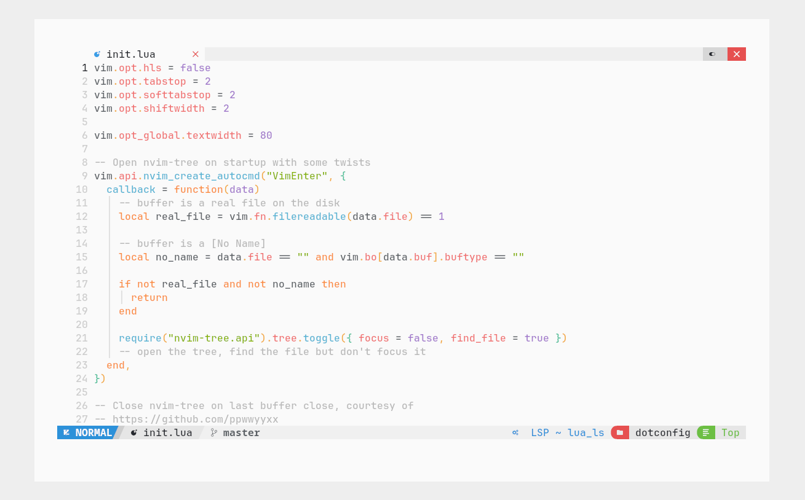
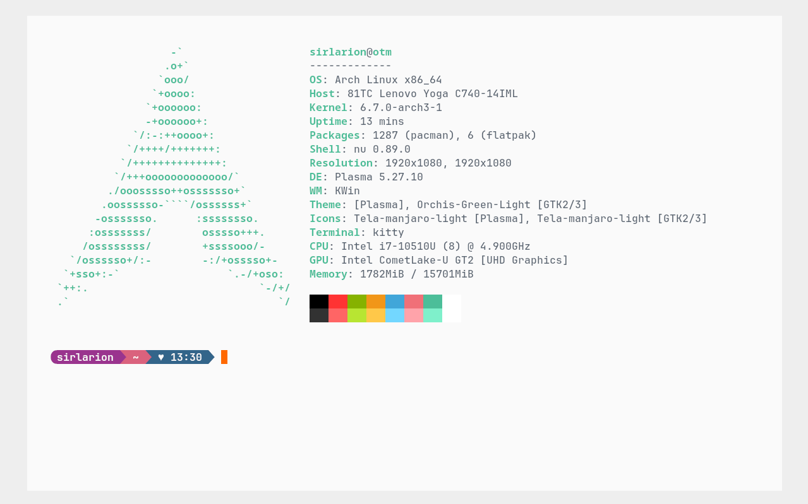
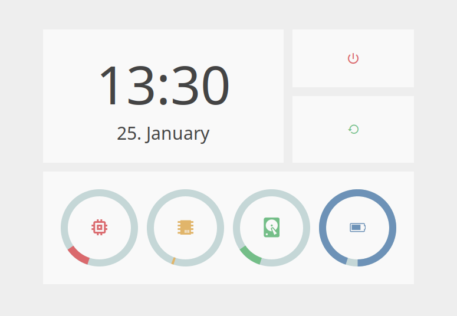

# dotconfig

.config files built for some Linux apps mainly. Some Mac compatibility
is sprinkled in as well.

### Apps 

#### Terminal

* [Kitty terminal](https://sw.kovidgoyal.net/kitty/#)
* Shell
    * On Linux: [Nushell](https://www.nushell.sh/)
    * On Mac: [Fish](https://fishshell.com/)

#### Dev work

* [Neovim](https://neovim.io/)
    * With [NvChad](https://nvchad.com/)

#### Other

* Dashboard [EWW](https://elkowar.github.io/eww/)
* PDF Reader [Zathura](https://pwmt.org/projects/zathura/)
* App launcher [Rofi](https://github.com/davatorium/rofi)

Also some miscellaneous stuff

### Deploying

`./deploy` (`./deploy_mac` on Mac)
